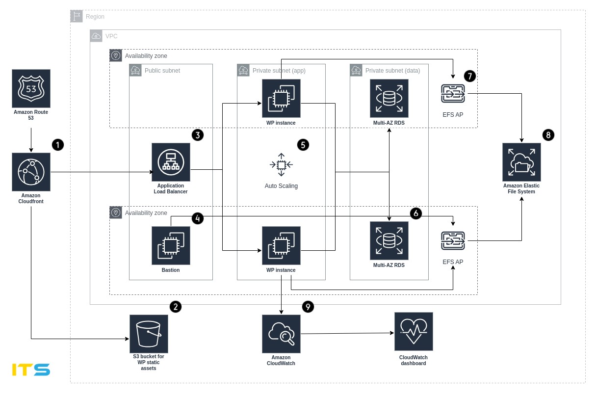

## Course work

1. Infrasructure. According to the scheme, spin up the infrastructure using terragrunt.

Architecture components

The reference architecture illustrates a complete best practice deployment for a WordPress website on AWS.

 - It starts with edge caching in Amazon CloudFront (1) to cache content close to end users for fasterdelivery.  
 - CloudFront pulls static content from an S3 bucket (2) and dynamic content from an Application Load Balancer (3) in front of the web instances.  
 - The web instances run in an Auto Scaling group of Amazon EC2instances (5).  
 - MySQL multi-az RDS (6) hosts the WordPress database.  
 - The WordPress EC2 instances access shared WordPress data on an Amazon EFS (8) file system via an EFS access point (7).  
 - Bastion host (4) is used for SFTP access to EFS and tunnel to the database.  
 - Infrastructure logs and metrics are collected in CloudWatch with a convenient dashboard (9).

2. Automation. Prepare two Ansible roles: one for preparing an AMI image for app instances, the second we deploy site components to infra.

You need to fork this repo, work with your copy and then create PR to this repo so we can see your commits.

### [Documentation](https://docs.google.com/document/d/1JCv2ayPH5Hc9f3fcNNmOWT8ThjtROTedkKDdKVoIQH0/edit?usp=sharing)
